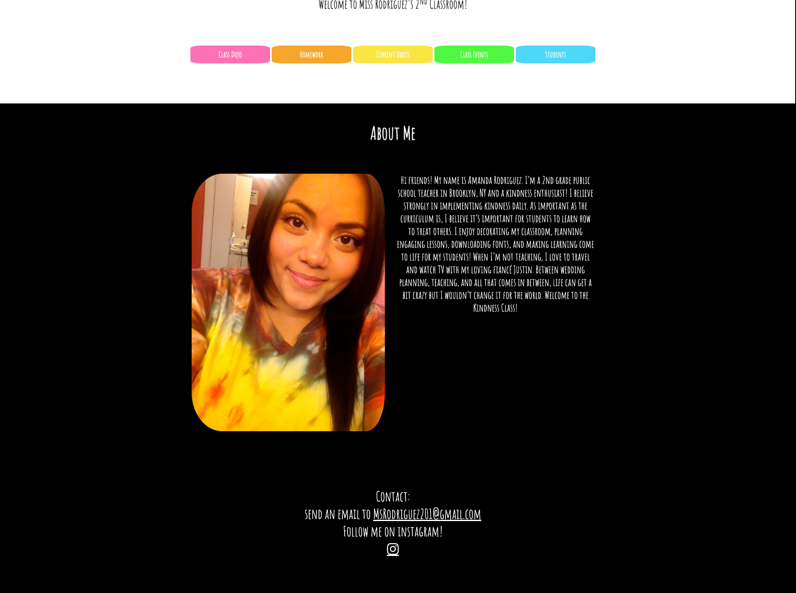
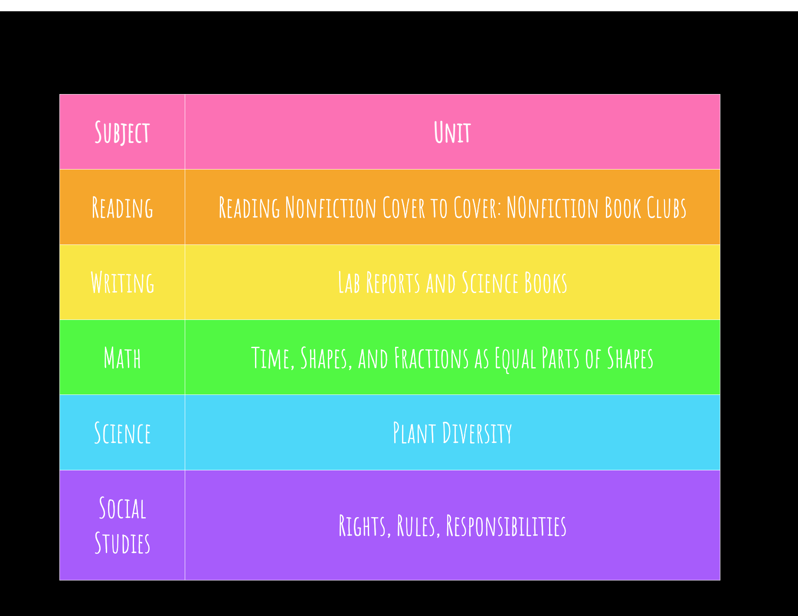
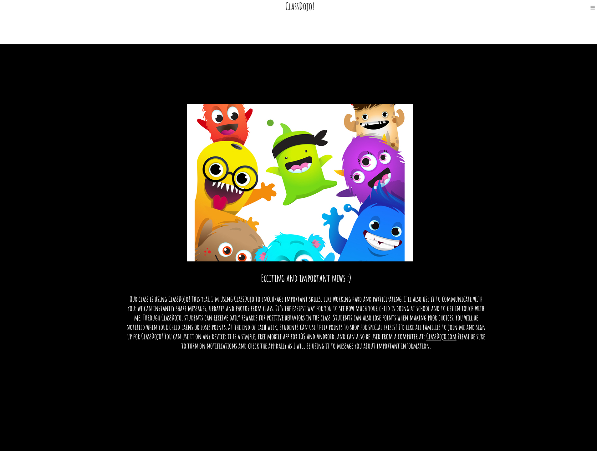

# theKindnessClass


## Description

> Welcome to the Kindness Class. This is a demo website for a teacher. It contains class resources, helpful links for students, and calendars for parents. 

[Live Link](https://kindness-teacher-demo.herokuapp.com/)

## Installation Instructions
* Fork this repository
* Clone it down to your local machine
* Open in a code editor
* ```npm i``` in order to download the node modules
* node app.js to start the project

## User Stories
- As a user I want to be able to connect with the teacher
- As a user I want to create a relationship between the Parents and Teachers
- As a user I want to be able to find missing work from class

## Screen shots
#### Landing


#### Unit


#### Dojo


## Minimun Viable Product

* Demo website to access classroom information
* View calendars/unit schedules

## Technologies Used

* JavaScript
* Node.js
* jQuery
* HTML
* CSS
